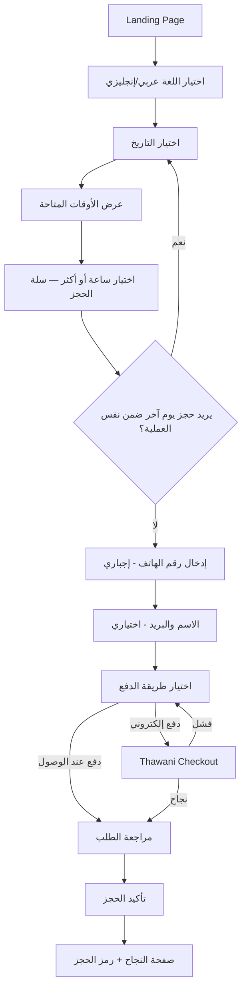
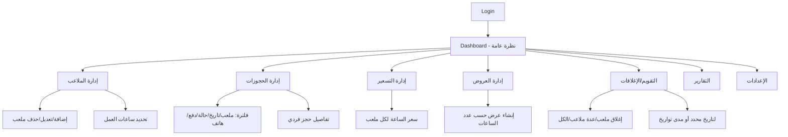
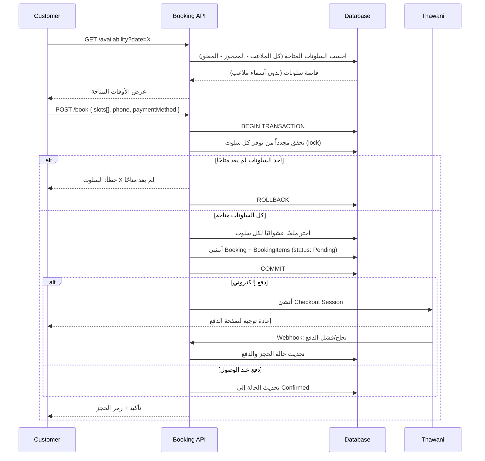
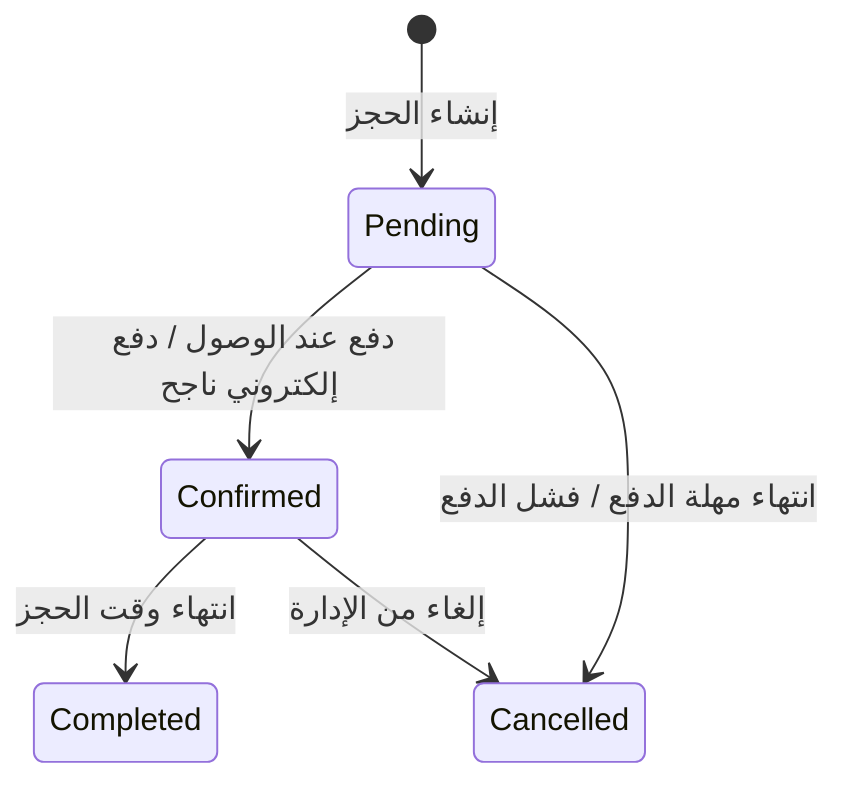

# App Flow — تدفق النظام
## منصة حجز ملاعب البادل

---

## 1. تدفق العميل (Customer Flow)

### تفاصيل كل خطوة

| الخطوة | التفاصيل التقنية |
|---|---|
| Landing | عرض تعريف بسيط بالمنشأة + زر "احجز الآن" |
| اختيار اللغة | Toggle يبدّل i18next locale فوريًا + اتجاه الصفحة (RTL/LTR) |
| اختيار التاريخ | Date Picker يمنع اختيار تواريخ ماضية |
| عرض الأوقات | `GET /api/customer/availability?date=...` → قائمة سلوتات (بدون أسماء ملاعب) |
| سلة الحجز | إدارة محلية (state) لكل السلوتات المختارة عبر تواريخ/ساعات متعددة |
| بيانات العميل | Validation: رقم هاتف عُماني بصيغة صحيحة (إجباري)، بريد بصيغة صحيحة إن أُدخل |
| الدفع | Thawani Checkout Session أو وسم "دفع عند الوصول" |
| التأكيد | `POST /api/customer/book` → Transaction تُخصّص الملاعب عشوائيًا لكل سلوت |
| النجاح | عرض رمز مرجعي (Booking Reference) + ملخص + تفاصيل بدون اسم الملعب |

---

## 2. تدفق الإدارة (Admin Flow)

---

## 3. منطق الحجز التفصيلي (Booking Engine Sequence)

---

## 4. حالات الحجز (Booking Status State Machine)

