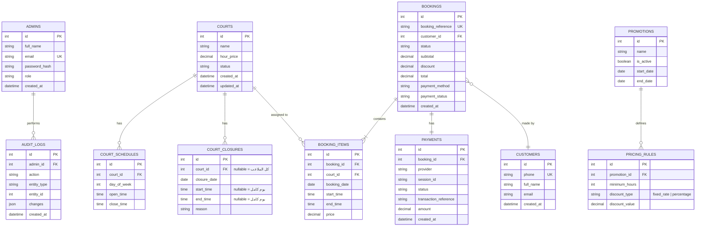

# Backend & Database Schema
## منصة حجز ملاعب البادل

---

## 1. مخطط العلاقات (ERD)



---

## 2. تفاصيل الجداول (Table Specifications)

### `admins`
| العمود | النوع | ملاحظات |
|---|---|---|
| id | BIGINT PK AUTO_INCREMENT | |
| full_name | VARCHAR(120) | |
| email | VARCHAR(150) UNIQUE | تسجيل الدخول |
| password_hash | VARCHAR(255) | BCrypt |
| role | ENUM('SuperAdmin','Manager') | لتوسع مستقبلي |
| created_at | DATETIME | |

### `courts`
| العمود | النوع | ملاحظات |
|---|---|---|
| id | BIGINT PK | |
| name | VARCHAR(100) | **لا يُعرض للعميل أبدًا** |
| hour_price | DECIMAL(10,2) | سعر الساعة الأساسي بالريال |
| status | ENUM('Active','Inactive') | |
| created_at / updated_at | DATETIME | |

### `court_schedules`
ساعات العمل الأسبوعية القياسية لكل ملعب (0 = الأحد ... 6 = السبت).
| العمود | النوع |
|---|---|
| id | BIGINT PK |
| court_id | FK → courts |
| day_of_week | TINYINT (0-6) |
| open_time | TIME |
| close_time | TIME |

### `court_closures`
إغلاقات استثنائية (يوم كامل أو فترة محددة). `court_id = NULL` يعني إغلاق **كل** الملاعب.
| العمود | النوع |
|---|---|
| id | BIGINT PK |
| court_id | FK → courts NULLABLE |
| closure_date | DATE |
| start_time / end_time | TIME NULLABLE |
| reason | VARCHAR(255) NULLABLE |

### `customers`
سجل بسيط يُنشأ/يُحدَّث تلقائيًا عند كل حجز (بدون كلمة مرور — لا يوجد تسجيل دخول للعميل).
| العمود | النوع |
|---|---|
| id | BIGINT PK |
| phone | VARCHAR(20) UNIQUE |
| full_name | VARCHAR(120) NULLABLE |
| email | VARCHAR(150) NULLABLE |
| created_at | DATETIME |

### `bookings`
الحجز الأب — قد يحتوي عدة سلوتات (`booking_items`) ضمن عملية واحدة.
| العمود | النوع | ملاحظات |
|---|---|---|
| id | BIGINT PK | |
| booking_reference | VARCHAR(12) UNIQUE | يُولَّد عشوائيًا (مثال: `PDL-8X2K91`) |
| customer_id | FK → customers | |
| status | ENUM('Pending','Confirmed','Cancelled','Completed') | |
| subtotal / discount / total | DECIMAL(10,2) | |
| payment_method | ENUM('PayOnArrival','Online') | |
| payment_status | ENUM('Unpaid','Paid','Failed','Refunded') | |
| created_at | DATETIME | |

### `booking_items`
كل سطر = ساعة واحدة في ملعب مُخصَّص عشوائيًا.
| العمود | النوع |
|---|---|
| id | BIGINT PK |
| booking_id | FK → bookings |
| court_id | FK → courts (الملعب المُخصَّص فعليًا) |
| booking_date | DATE |
| start_time / end_time | TIME |
| price | DECIMAL(10,2) |

> **قيد فريد (Unique Constraint):** `(court_id, booking_date, start_time)` لمنع الحجز المزدوج فعليًا على مستوى قاعدة البيانات، بالإضافة للتحقق البرمجي.

### `payments`
| العمود | النوع |
|---|---|
| id | BIGINT PK |
| booking_id | FK → bookings |
| provider | VARCHAR(30) ('Thawani', 'Cash') |
| session_id | VARCHAR(100) NULLABLE |
| status | ENUM('Initiated','Success','Failed') |
| transaction_reference | VARCHAR(100) NULLABLE |
| amount | DECIMAL(10,2) |
| created_at | DATETIME |

### `promotions` + `pricing_rules`
عرض واحد قد يحتوي عدة شرائح (Tiers).
```
promotions: { id, name, is_active, start_date, end_date }
pricing_rules: { id, promotion_id, minimum_hours, discount_type, discount_value }
```
مثال بيانات:
```
promotion: "عرض الساعات المتعددة"
  rule 1: minimum_hours=1 → rate=10.00 (fixed_rate)
  rule 2: minimum_hours=2 → rate=8.00  (fixed_rate)
```

### `audit_logs`
| العمود | النوع |
|---|---|
| id | BIGINT PK |
| admin_id | FK → admins |
| action | VARCHAR(50) ('CourtCreated','BookingCancelled'...) |
| entity_type / entity_id | VARCHAR / BIGINT |
| changes | JSON |
| created_at | DATETIME |

---

## 3. مجموعات الـ API (API Groups)

| المجموعة | الوصف | الحماية |
|---|---|---|
| `/api/auth` | تسجيل دخول الإدارة، تجديد التوكن | عام (login) |
| `/api/admin/courts` | CRUD الملاعب + ساعات العمل | JWT |
| `/api/admin/closures` | إدارة إغلاقات الملاعب | JWT |
| `/api/admin/bookings` | عرض/فلترة/إلغاء الحجوزات | JWT |
| `/api/admin/promotions` | CRUD العروض | JWT |
| `/api/admin/pricing` | تحديث أسعار الملاعب | JWT |
| `/api/admin/dashboard` | إحصائيات ملخصة | JWT |
| `/api/customer/availability` | جلب الأوقات المتاحة | عام |
| `/api/customer/book` | إنشاء حجز جديد | عام |
| `/api/customer/bookings/{reference}` | استعلام عن حجز برقمه المرجعي | عام |
| `/api/payment/webhook` | استقبال إشعارات Thawani | Signature-verified |

راجع `07-API-Spec.yaml` للمواصفة الكاملة (OpenAPI).
